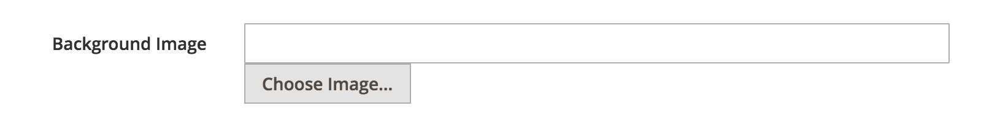
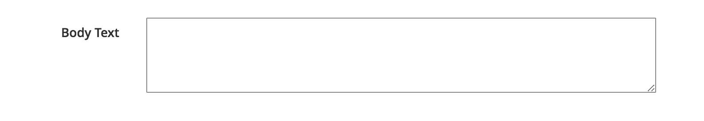
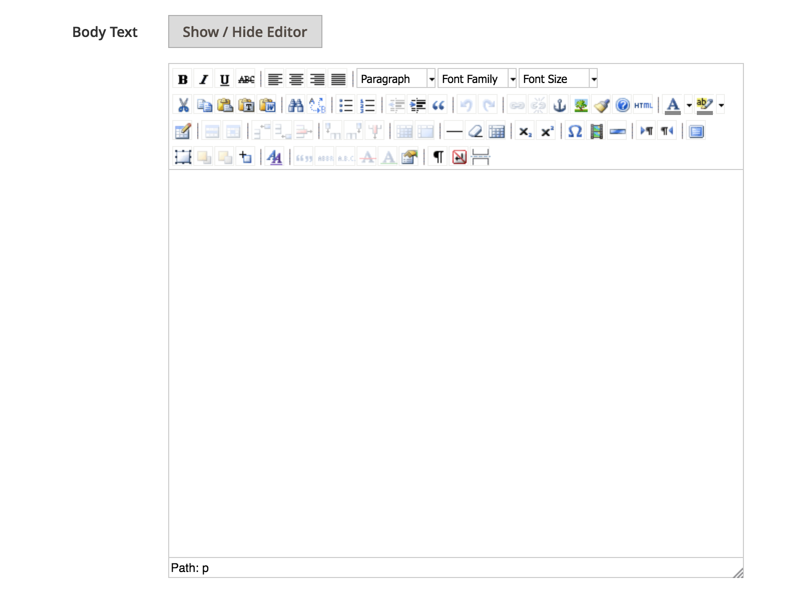

# Magento Widget Parameters

Useful widget parameter types for improved CMS Page building in Magento 2. Adds new parameter types like an image selector, wysiwyg text editor, or textarea. You can now use these parameter types in your custom widgets.

## How to Use

### Image Selector

```xml
<parameter xsi:type="block" name="background_image" visible="true" sort_order="10">
    <label translate="true">Background Image</label>
    <block class="Dmatthew\WidgetParameters\Block\Adminhtml\Widget\Type\ImageChooser">
        <data>
            <item name="button" xsi:type="array">
                <item name="open" xsi:type="string">Choose Image...</item>
            </item>
        </data>
    </block>
</parameter>
```



### Textarea

```xml
<parameter xsi:type="block" name="body_text" visible="true" sort_order="10">
    <label translate="true">Body Text</label>
    <block class="Dmatthew\WidgetParameters\Block\Adminhtml\Widget\Type\Textarea" />
</parameter>
```



### Wysiwyg

```xml
<parameter xsi:type="block" name="body_text" visible="true" sort_order="10">
    <label translate="true">Body Text</label>
    <block class="Dmatthew\WidgetParameters\Block\Adminhtml\Widget\Type\Wysiwyg" />
</parameter>
```



## License

[MIT](/LICENSE.txt)

## Attribution

This software uses Open Source software. See the [ATTRIBUTION](ATTRIBUTION.md) page for these projects.

